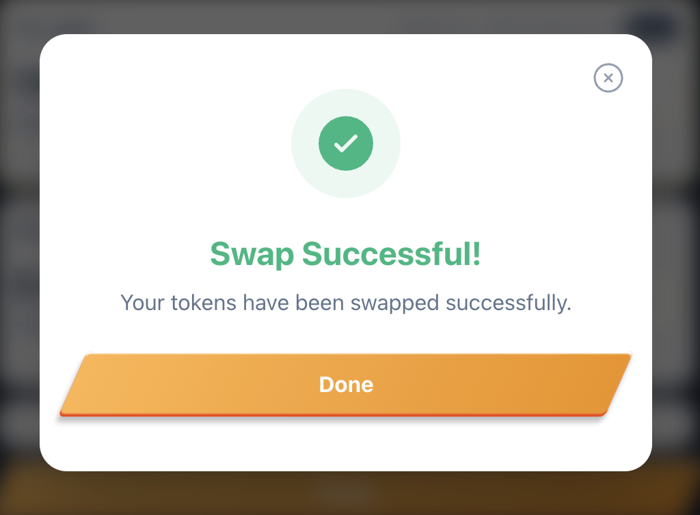

# Tech stack

- React + TypeScript + Vite
- React Compiler (remove the need of `memo`, `useMemo`, `useCallback`, but I still use `useMemo` and `useCallback` in components for showing skill)
- Jotai (managing global store)
- React Query (wrapped in jotai-tanstack-query, for caching queries, managing fetch status)
- Tailwindcss (styling)
- Framer motion (animation)
- Typescript
- Iconify (svg icon utility)

# Screenshot

